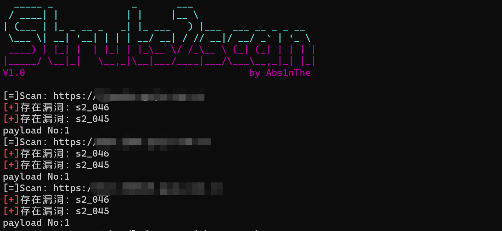
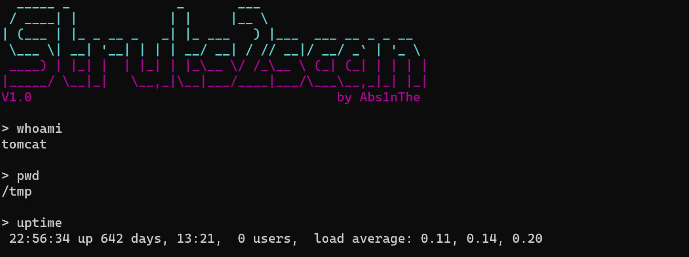

# Struts2scan 

是一款Struts2漏洞扫描和验证工具，支持命令执行、反弹shell、http代理、批量扫描。

支持漏洞：s2_001 s2_005 s2_007 s2_008 s2_009 s2_013 s2_015 s2_032 s2_045 s2_046 s2_048 s2_052 s2_053 s2_057 s2_059 s2_061

## 安装：

python3

```
# 安装所需的 python 依赖
pip install -r requirements.txt
```

## 使用：

扫描、批量扫描、使用代理扫描：

```
python Struts2scan.py -u http://example.com
python Struts2scan.py -f list.txt
python Struts2scan.py -f list.txt -p http://127.0.0.1:8080
```

漏洞利用、使用代理利用：

```
python Struts2scan.py -u http://example.com -e s2_045
python Struts2scan.py -u http://example.com -e s2_045 -p http://127.0.0.1:8080
```





## 免责声明：

本工具仅面向合法授权的企业安全建设行为，在使用本工具进行检测时，您应确保该行为符合当地的法律法规，并且已经取得了足够的授权，请勿对非授权目标进行扫描。

如您在使用本工具的过程中存在任何非法行为，您需自行承担相应后果，我们将不承担任何法律及连带责任。

在安装并使用本工具前，请您务必审慎阅读、充分理解各条款内容，除非您已充分阅读、完全理解并接受本协议所有条款，否则，请您不要安装并使用本工具。您的使用行为或者您以其他任何明示或者默示方式表示接受本协议的，即视为您已阅读并同意本协议的约束。